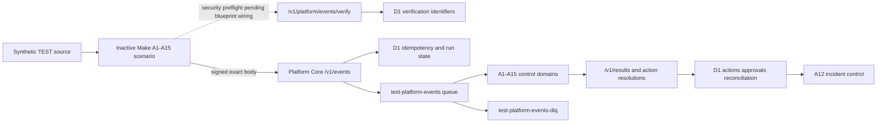

# TEST resource graph

The graph records the deployed TEST control plane. Dashed edges are available
but not yet wired into every Make blueprint.

## Safety boundary

All resources in this graph are TEST resources. Production deployment,
scenario activation, public send, content publication, GBP mutation, outreach,
dangerous replay, site launch, experiment launch, and pricing change remain
disabled. The verification registry stores only identifiers and timestamps;
it does not store event payloads or trigger provider work.

## Current completion boundary

- The Platform Core verification route, migration, local tests, deployment,
  and negative live smoke are complete.
- Existing signed `/v1/events` paths remain operational.
- Wiring `/v1/platform/events/verify` into each inactive Make blueprint and
  repeating signed end-to-end evidence remains pending.
- Provider-health evidence is not equivalent to full provider workflow
  completion; the per-automation readiness files remain authoritative.
